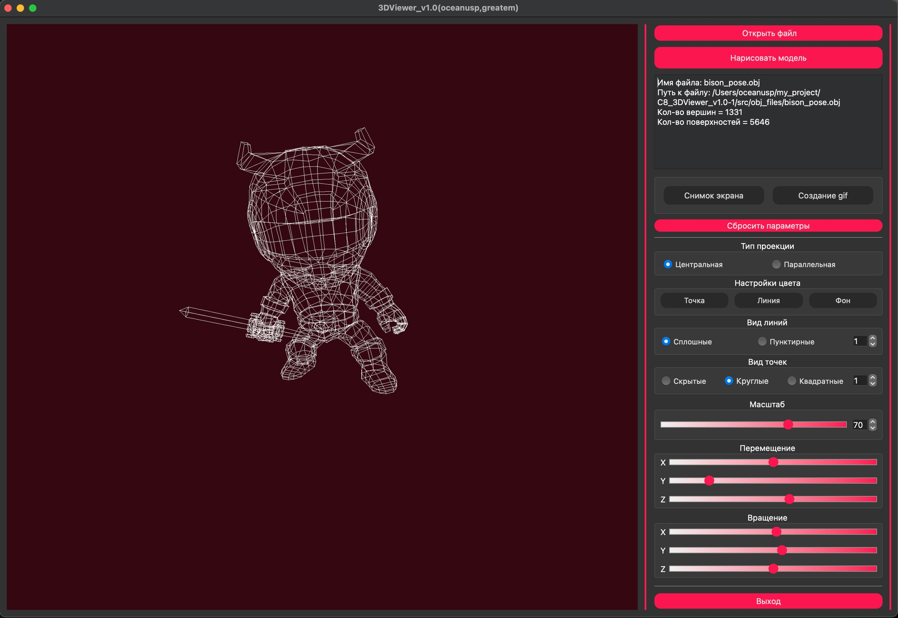

# Программа визуализации 3D моделей
- 

    Этот репозиторий содержит программу которая разработанна в рамках образовательного проекта в School21 от Сбер и представляет собой инструмент для просмотра и взаимодействия с трехмерными моделями в формате файлов *.obj.

    Визуализация моделей реализована с использованием библиотеки OpenGL. Для достижения эффекта перемещения и манипулирования вершинами модели используются аффинные преобразования. После применения этих преобразований новые координаты вершин передаются на отрисовку в OpenGL. Визуализация в OpenGL осуществляется на центральном процессоре, и шейдеры в данной программе не используются. 3D Viewer обладает функциональностью сохранения изображений. Возможность создания снимка экрана (ScreenShot) предоставляет пользователю способ зафиксировать текущее состояние модели в выбранной директории. Проект 3D Viewer v1.0 был разработан с учетом образовательных целей и служит практическим примером работы с 3D-моделями и OpenGL в среде программирования. Fronted написан на языке С++, Backend на языке С.


## Программа предоставляет возможность:

    - Загружать каркасную модель из файла формата obj (поддержка только списка вершин и поверхностей).
    - Перемещать модель на заданное расстояние относительно осей X, Y, Z.
    - Поворачивать модель на заданный угол относительно своих осей X, Y, Z
    - Масштабировать модель на заданное значение.

## В программе реализован графический пользовательский интерфейс, на базе GUI-библиотеки Qt, которая содержит:

    - Кнопку для выбора файла с моделью и поле для вывода его названия.
    - Зону визуализации каркасной модели.
    - Кнопку/кнопки и поля ввода для перемещения модели. 
    - Кнопку/кнопки и поля ввода для поворота модели. 
    - Кнопку/кнопки и поля ввода для масштабирования модели.  
    - Информацию о загруженной модели - название файла, кол-во вершин и ребер.
    - Программа способна корректно обрабатывать и позволять пользователю просматривать модели с деталями до 100, 1000, 10 000, 100 000, 1 000 000 вершин без зависания (зависание - это бездействие интерфейса более 0,5 секунды).


## Дополнительные возможности

    - Возможность выбора типа проекции (параллельной и центральной).
    - Настройка ребер (тип, цвет, толщина).
    - Опции отображения вершин (тип, цвет, размер).
    - Выбор цвета фона.
    - Сохранение настроек между перезапусками программы.
    - Сохранение отрендеренных изображений в форматах BMP и JPEG.
    - Запись небольших "скринкастов" пользовательских преобразований в GIF-анимацию.


## Инструкции по сборке
- Для сборки программы используйте предоставленный Makefile:
```bash
make all
```
- Для установки программы(на рабочем столе появится ярлык для запуска):
```bash
make install
```
- Для удаления программы:
```bash
make uninstall
```
- Для удаления временных файлов сборки:
```bash
make clean
```
- Для просмотра документации:
```bash
make dvi
```
